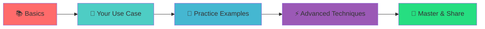

<div align="center">

# 🎯 Prompt Engineering Mastery Guide

<p align="center">
  <strong>The Complete Guide to AI Communication Excellence</strong>
</p>

<p align="center">
  
  
  
</p>

<p align="center">
  Master the art and science of communicating with AI models effectively.<br/>
  From basic prompts to advanced techniques - everything you need to unlock AI's full potential.
</p>

</div>

---

## ✨ What Makes This Guide Special

<table>
<tr>
<td width="50%">

### 🎓 **Learn at Your Level**
- **Beginners**: Start with simple, everyday examples
- **Professionals**: Role-specific guides for your field
- **Advanced Users**: Sophisticated techniques and optimization

</td>
<td width="50%">

### 🛠️ **Practical & Ready-to-Use**
- **Templates**: Copy-paste prompts for immediate use
- **Examples**: Real-world scenarios across industries
- **Best Practices**: Proven techniques that work

</td>
</tr>
</table>

---

## 🗺️ Navigate Your Journey

<div align="center">

### 🚀 Quick Start Paths

</div>

<table>
<tr>
<td align="center" width="25%">
<br/>
<strong><a href="./basics/">📚 Basics Guide</a></strong><br/>
<em>Simple explanations & first steps</em>
</td>
<td align="center" width="25%">
<br/>
<strong><a href="./use-cases/developers/">💻 For Developers</a></strong><br/>
<em>Code generation & debugging</em>
</td>
<td align="center" width="25%">
<br/>
<strong><a href="./use-cases/business-users/">💼 For Business</a></strong><br/>
<em>Content & analysis tasks</em>
</td>
<td align="center" width="25%">
<br/>
<strong><a href="./techniques/advanced/">⚡ Advanced</a></strong><br/>
<em>Sophisticated techniques</em>
</td>
</tr>
</table>

---

## 📋 Complete Repository Structure

<details>
<summary><strong>📖 Foundation & Learning</strong> <em>(Click to expand)</em></summary>

```
📚 Learning Materials
├── 📖 basics/           → Start here - Simple explanations for everyone
├── 🧠 concepts/         → Core concepts with analogies & examples
└── 🏗️ architecture/     → How AI works (diagrams included)
```

</details>

<details>
<summary><strong>👥 Role-Based Guides</strong> <em>(Click to expand)</em></summary>

```
🎯 Use Cases by Profession
├── 💻 developers/       → Code generation, debugging, documentation
├── 🧪 qa/              → Testing, automation, bug analysis  
├── 💼 business-users/   → Content creation, analysis, strategy
└── ✍️ content-creators/ → Writing, marketing, creative tasks
```

</details>

<details>
<summary><strong>⚡ Advanced & Practical</strong> <em>(Click to expand)</em></summary>

```
🚀 Advanced Resources
├── ⚡ techniques/       → Advanced prompting strategies
├── 📝 examples/         → Practical, copy-ready examples
├── 📋 templates/        → Ready-to-use prompt templates
└── 📚 resources/        → Tools, links, further reading
```

</details>

---

## 🎯 Choose Your Role

<div align="center">

*Select your primary use case to get started immediately*

</div>

| Role | What You'll Learn | Quick Start |
|------|-------------------|-------------|
| **🔧 Developer** | Code generation, debugging, documentation, architecture design | [Start Coding →](./use-cases/developers/) |
| **🧪 QA Engineer** | Test case creation, automation scripts, bug analysis | [Start Testing →](./use-cases/qa/) |  
| **💼 Business Professional** | Reports, emails, strategy, data analysis | [Start Analyzing →](./use-cases/business-users/) |
| **✍️ Content Creator** | Writing, marketing copy, creative content | [Start Creating →](./use-cases/content-creators/) |
| **🎓 Student/Learner** | Understanding concepts, learning efficiently | [Start Learning →](./basics/) |

---

## 🏃‍♂️ 3-Minute Quick Start

<div align="center">

### Get results in 3 minutes or less

</div>

1. **📚 [Read the Basics](./basics/)** *(1 minute)* - Understand what prompt engineering is
2. **📋 [Grab a Template](./templates/)** *(30 seconds)* - Copy a ready-made prompt
3. **🚀 [Try It Out](./examples/basic/)** *(1.5 minutes)* - Use it with your favorite AI tool

---

## 💡 What You'll Master

<table>
<tr>
<td width="33%" align="center">

### 🎯 **Precision**
Write prompts that get exactly what you need on the first try

</td>
<td width="33%" align="center">

### ⚡ **Efficiency** 
Save time with proven templates and techniques

</td>
<td width="33%" align="center">

### 🧠 **Expertise**
Understand how AI thinks and responds

</td>
</tr>
</table>

---

## 📈 Learning Roadmap



<div align="center">
<em>Follow this path for systematic learning, or jump directly to what you need most</em>
</div>

---

## 🌟 Popular Resources

<div align="center">

### Most accessed content in this repository

</div>

| 🔥 **Hot Picks** | 📊 **Usage** | 💡 **Perfect For** |
|------------------|--------------|---------------------|
| [📋 Ready-to-Use Templates](./templates/) | ⭐⭐⭐⭐⭐ | Quick wins & daily tasks |
| [💻 Developer Prompts](./use-cases/developers/) | ⭐⭐⭐⭐⭐ | Code generation & debugging |  
| [🧠 How AI Works](./architecture/) | ⭐⭐⭐⭐ | Understanding the technology |
| [📝 Basic Examples](./examples/basic/) | ⭐⭐⭐⭐ | Learning by doing |

---

## 🤝 Community & Contributing

<div align="center">

### Join the Prompt Engineering Community

<a href="https://github.com/yourusername/prompt-engineering/issues/new?template=example_request.md">
  
</a>
<a href="https://github.com/yourusername/prompt-engineering/issues/new?template=improvement.md">
  
</a>

</div>

**🎉 Ways to Contribute:**
- **💡 Share Examples**: Add prompts that worked well for you
- **📝 Improve Docs**: Make explanations clearer
- **🐛 Report Issues**: Help us fix problems
- **⭐ Star the Repo**: Help others discover this resource

---

## 📊 Repository Stats

<div align="center">


</div>

---

## 📜 License & Usage

This repository is **open source** and available under the [MIT License](LICENSE). 

✅ **You can:**
- Use all content commercially
- Modify and adapt examples
- Share and distribute freely
- Build upon this work

---

<div align="center">

### Ready to Transform Your AI Interactions?

<a href="./basics/">
  
</a>

<p><em>Master prompt engineering and unlock AI's full potential for your work and projects</em></p>

---

<sub>⭐ **Star this repository** if you find it helpful | 🔗 **Share** with your team | 💬 **Contribute** your own examples</sub>

</div>