<div align="center">

# 🎯 Prompt Engineering Basics

<p align="center">
  
  
  
</p>

<p align="center">
  <strong>Your first step into the world of AI communication</strong><br/>
  Master the fundamentals with simple explanations and practical examples
</p>

</div>

---

## 🤔 What is Prompt Engineering?

<div align="center">

### The Simple Definition

</div>

<table>
<tr>
<td width="50%">

**Prompt Engineering** is the art and science of crafting instructions (called "prompts") to get the best responses from AI models like ChatGPT, Claude, or Gemini.

</td>
<td width="50%">

**Think of it like this**: If AI is a very smart assistant, prompt engineering is learning how to ask questions and give instructions in a way that gets you exactly what you need.

</td>
</tr>
</table>

## 🧠 How AI Understands Your Prompts

<details>
<summary><strong>🔍 The Simple Analogy</strong> <em>(Click to expand)</em></summary>

<br/>

Imagine you're talking to a brilliant colleague who:
- 🎓 **Knows a lot** about many topics
- 💪 **Wants to help** you succeed
- 📝 **Needs clear instructions** to give you the best answer
- 🚫 **Can't read your mind** - be explicit!

</details>

<div align="center">

### 🔄 The AI Process Flow

```mermaid
graph LR
    A["📝 Your Prompt"] --> B["🧠 AI Processing"]
    B --> C["💡 Response"]
    
    B1["🔍 Understanding"] --> B
    B2["📚 Context Analysis"] --> B
    B3["⚙️ Instruction Processing"] --> B
    
    style A fill:#FF6B6B
    style B fill:#4ECDC4
    style C fill:#45B7D1
```

</div>



## 🎨 Basic Prompt Structure

<div align="center">

### The Building Blocks of Great Prompts

</div>

<table>
<tr>
<td align="center" width="33%">

### 1️⃣ **Context**
*What's the situation?*

```
"I'm a small business owner 
launching a new product..."
```


</td>
<td align="center" width="33%">

### 2️⃣ **Task**
*What do you want?*

```
"...write a social media post..."
```


</td>
<td align="center" width="33%">

### 3️⃣ **Requirements**
*How should it be done?*

```
"...that's engaging, under 280 
characters, and includes CTA."
```


</td>
</tr>
</table>

<div align="center">

### 🔗 Complete Example

</div>

<div align="center">
<table>
<tr>
<td>

```
I'm a small business owner launching a new eco-friendly water bottle. 
Write a social media post that's engaging, under 280 characters, 
and includes a call-to-action.
```

</td>
</tr>
</table>
</div>

## 🏗️ Essential Prompt Types

### 1. **Instruction Prompts**
Direct commands for specific tasks
```
"Explain quantum physics in simple terms."
"Generate 5 creative names for a coffee shop."
"Summarize this article in 3 bullet points."
```

### 2. **Role-Based Prompts**
Ask AI to act as a specific expert
```
"Act as a marketing expert and create a campaign strategy."
"You are a teacher. Explain fractions to a 10-year-old."
"As a financial advisor, review this budget."
```

### 3. **Example-Based Prompts**
Show the AI what you want with examples
```
"Write product descriptions like these examples:
Example 1: [your example]
Example 2: [your example]

Now write one for: [your product]"
```

## ⚡ Quick Tips for Better Prompts

### ✅ DO:
- **Be specific**: "Write a 200-word blog intro" vs "Write something"
- **Provide context**: "For a fitness blog targeting beginners"
- **Use examples**: Show the AI what good output looks like
- **Set constraints**: Word count, tone, format, etc.

### ❌ DON'T:
- Be vague: "Make this better"
- Assume the AI knows your context
- Use overly complex language unnecessarily
- Forget to specify the output format you want

## 🎯 Common Use Cases

| **Task** | **Example Prompt** |
|----------|-------------------|
| **Writing** | "Write a professional email declining a meeting invitation, keeping a friendly tone" |
| **Analysis** | "Analyze the pros and cons of remote work for small businesses" |
| **Creation** | "Create a 7-day workout plan for beginners with no equipment" |
| **Problem-solving** | "I need to reduce customer service response time. Suggest 5 practical solutions" |
| **Learning** | "Explain machine learning like I'm 12 years old, using everyday examples" |

## 🔧 Prompt Templates to Get Started

### General Task Template
```
Context: [Describe your situation]
Task: [What you want done]
Requirements: [Specific needs, constraints, format]
```

### Creative Task Template
```
Create a [type of content] for [target audience] 
that [desired outcome/emotion].
Style: [tone/style preferences]
Length: [word count or time limit]
```

### Problem-Solving Template
```
I'm facing this challenge: [describe problem]
My constraints are: [limitations/resources]
Please suggest [number] solutions that are [specific requirements].
```

---

## 🚀 Your Next Steps

<div align="center">

### Choose Your Learning Path

</div>

<table>
<tr>
<td align="center" width="25%">

**🎯 Practice Now**

<a href="../examples/basic/">

</a>

*Use the templates above with real tasks*

</td>
<td align="center" width="25%">

**👥 Find Your Role**

<a href="../use-cases/">

</a>

*Developer, QA, Business, Creator*

</td>
<td align="center" width="25%">

**🧠 Dive Deeper**

<a href="../concepts/">

</a>

*Advanced understanding*

</td>
<td align="center" width="25%">

**⚡ Get Advanced**

<a href="../techniques/advanced/">

</a>

*Sophisticated techniques*

</td>
</tr>
</table>

---

<div align="center">

### 💡 Pro Tips for Success

<table>
<tr>
<td width="50%">

**✅ DO This:**
- Start with simple, clear prompts
- Practice with the templates provided
- Experiment with different approaches
- Save prompts that work well for you

</td>
<td width="50%">

**🎯 Remember:**
- Good prompting = Good communication
- Specificity beats vagueness every time
- Context is your best friend
- Practice makes perfect!

</td>
</tr>
</table>

</div>

---

<div align="center">

**🎉 Ready to level up your AI interactions?**

<p><em>You've got the basics down - now it's time to put them into practice!</em></p>

<sub>📚 <a href="../">← Back to Main Guide</a> | 🚀 <a href="../examples/basic/">Try Examples →</a></sub>

</div>